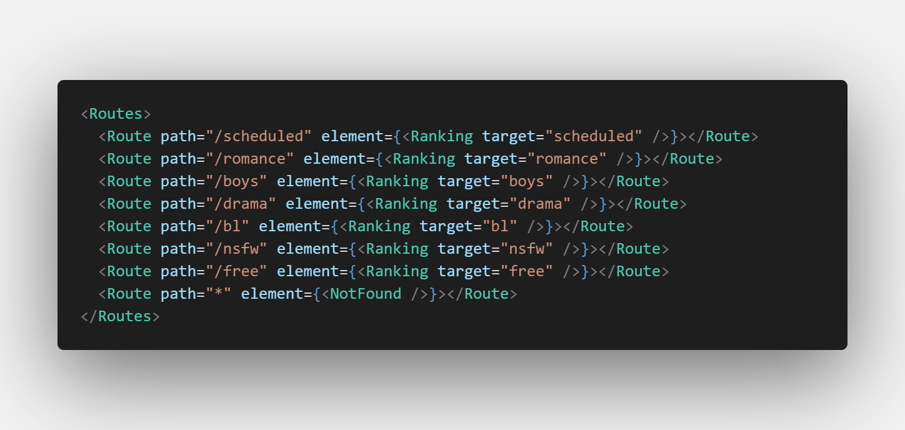
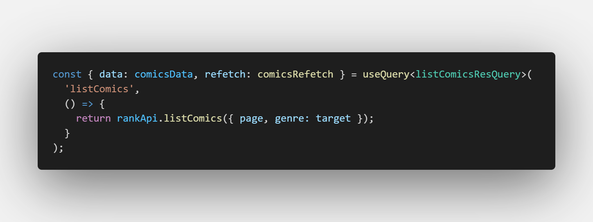
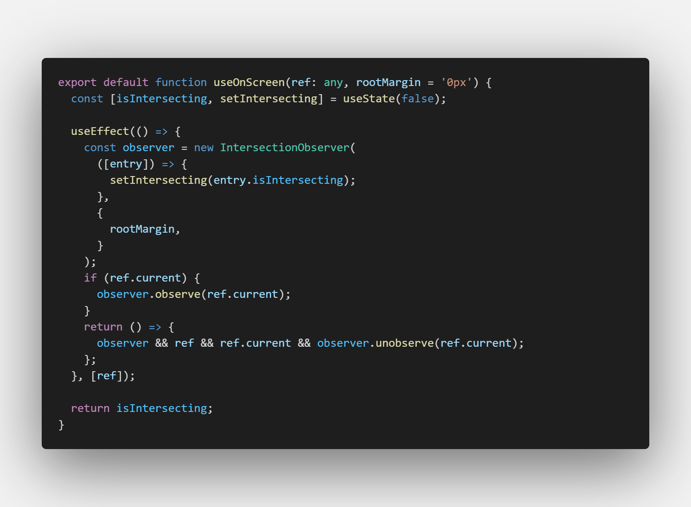
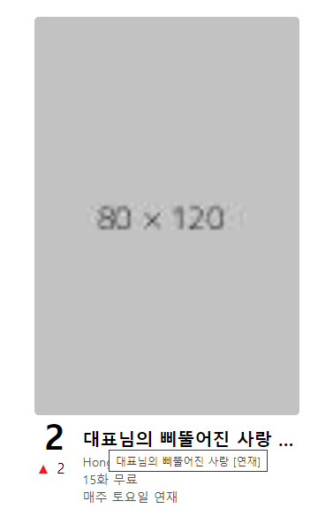
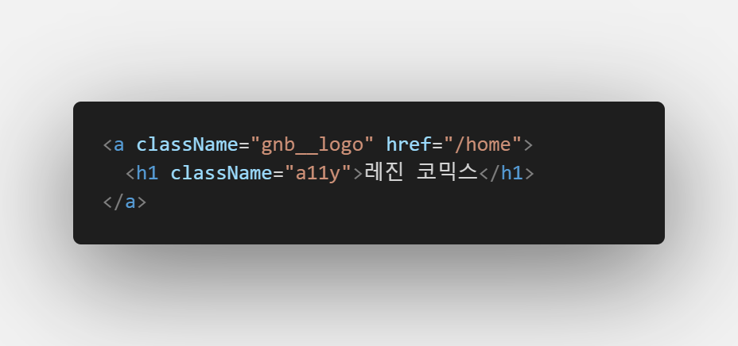
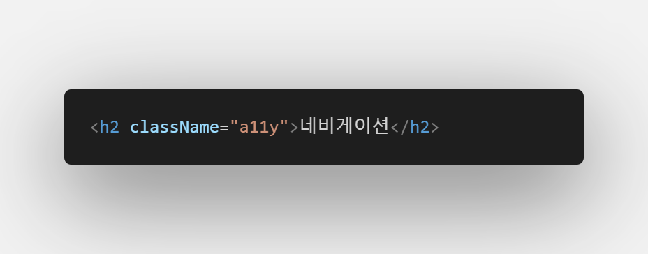
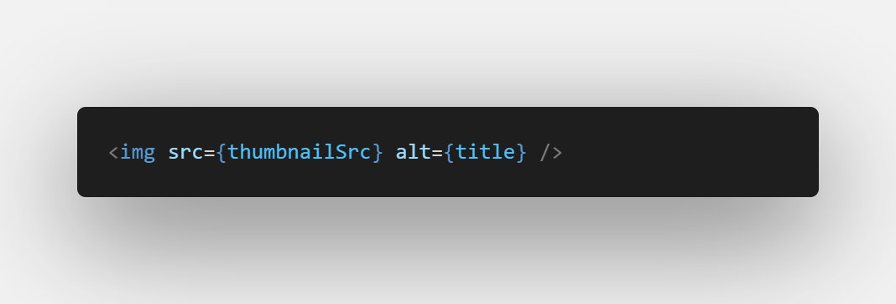
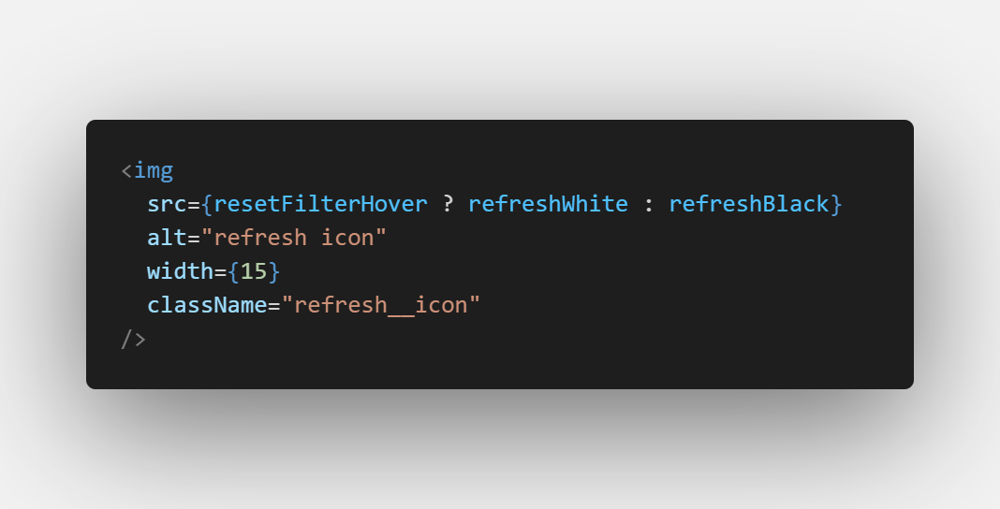

# Lezhin Front-end Homework

## 개요

로맨스 장르 작품 랭킹 리스트 컴포넌트 과제를 제출합니다.

- 폴더는 back_end, front_end 폴더로 구분되어 있습니다.
- back_end 폴더에는 api 요청을 주고받기 위한 간단한 mock server 가 들어있습니다.
- front_end 폴더에는 제가 제출할 과제가 들어있습니다.

## 확인 방법

back_end 웹 서버와 front_end 웹 서버를 각각 실행해 주세요.
back_end 는 8080 포트, front_end 는 3000 포트에서 실행 되도록 되어있습니다.

`1. back_end 라이브러리 설치 & 웹서버 구동`

```
cd back_end
npm i
nodemon server.js
```

`2. front_end 라이브러리 설치 & 웹서버 구동`

```
(터미널이 현재 백엔드 폴더에 있다면) cd ..
cd front_end
npm i
npm run start
```

## 설치된 라이브러리/프레임워크 설명

### - `react`

- vanilla / react 중 react 를 선택하여 개발하였습니다.

### - `redux / redux-toolkit`

- 선택구현 사항의 redux베이스의 상태관리 환경 구성을 위해 설치하였습니다.
- 로맨스 장르 외에 다른 장르에서도 이미 적용된 필터를 사용하기 위해 필터 상태관리에 이용하였습니다.

### - `react-router`

- 로맨스 장르 외에 다른 장르도 개발될 것을 염두에 두어 설치 하였습니다.

### - `axios`

- return 을 promise 객체로 주는등 http 통신의 response 를 다루기 쉬워 적용하였습니다.

### - `react-query`

- 순위 정보가 있어서 캐싱을 효율적으로 관리해주고 오래된 데이터를 자동으로 업데이트 해주는 react-query 를 비동기 통신 관리 라이브러리로써 사용하였습니다.

### - `sass`

- nesting, 변수 등의 기능을 이용하기 위해 사용하였습니다.

### - `typescript`

- 정적 타이핑으로 인한 생산성 향상을 위해 적용하였습니다.

## 화면 설명

- Desktop/Mobile 환경을 고려하기 위해 768px 이하는 모바일, 769px 이상은 데스크탑으로 고려하여 제작하였습니다.
- Desktop 환경에서 주요 요소를 flex 처리하여 반응형으로 제작하였습니다.

- Desktop 환경에서는 유저분들의 시선을 사로잡기 좋을것 같아 썸네일을 크게 적용하였습니다.
- Mobile 환경에서는 Desktop 환경에 비해 화면이 작아 썸네일이 너무 크면 뷰포트에 노출되는 컨텐츠 수가 적어서 이미지를 작게 적용하였습니다.


- 컴포넌트이므로 레진의 현재 사이트와 이질감이 대체로 들지 않도록 구성하였습니다.

## 구현 스펙 설명

- 재사용성 등을 고려해서 로맨스 장르 외 다른 장르에서 재사용 가능하도록 구조를 설계해 주세요.

  - Ranking 컴포넌트의 target props 를 이용해 다른 장르에서도 해당 컴포넌트를 이용할 수 있도록 개발하였습니다.

  - 

- 현재 뷰가 스크롤 하단에 도달 시 다음 리스트를 불러오는 형태의 무한 스크롤 기능을 구현해 주세요.

  - IntersectionObserver api 와 useRef hook 을 이용하여 컨텐츠 마지막 돔을 캐치하여 무한 스크롤 기능을 구현 하였습니다.
  - 

- 리스트 아이템 노출 정보를 노출해 주세요. 각 설명 상의 필드네임은 Interface를 확인해 주세요.

  - comics array 를 map 함수로 각각 호출한 뒤 구조분해 할당하여 썸네일, 타이틀, 작가명, 랭킹, 무료회차, 완결/연재 여부를 표시하였습니다.

- typescript 사용

  - 정적타입핑으로 개발생산성을 올리기 위해 적용하였습니다.

- redux베이스의 상태관리 환경 구성

  - 연재중 / 완결 / 무료회차 3개 이상의 필터는 다른 장르에서도 쉽게 사용 할 수 있도록 redux-toolkit 을 세팅하여 상태를 공유하도록 하였습니다.

- 필터링 조건을 해당컴포넌트에서 추가적으로 사용할 수 있도록 옵션으로 처리

  - 필터링을 사용하거나 초기화하여 필터링을 해제할 수 있도록 개발하였습니다.

- ui 통일성을 위해 긴 제목의 경우 ellipsis 를 적용하고 title을 제공하였습니다.

  - 

- accessibility 적용
  - 
    
    
    
